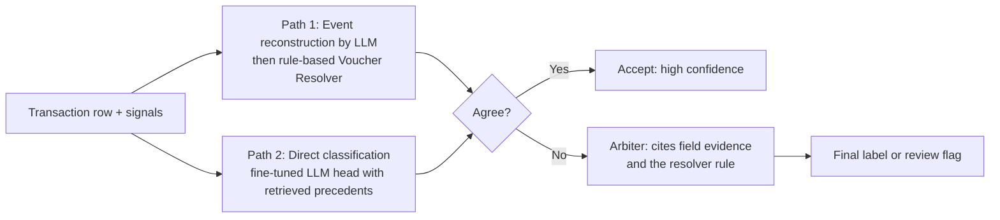
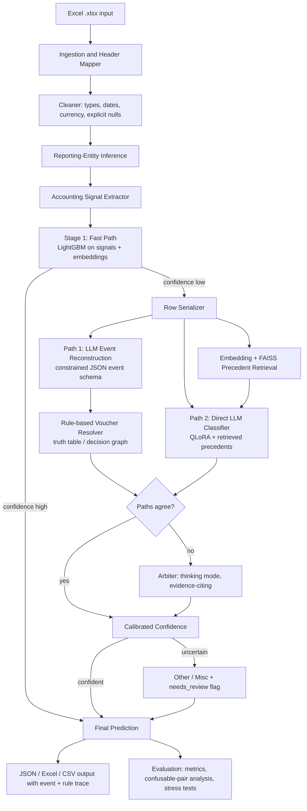
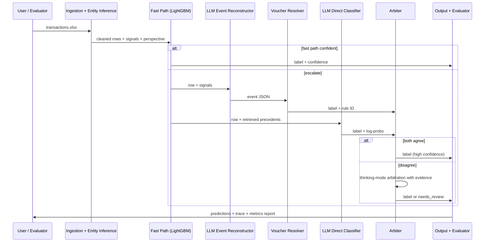
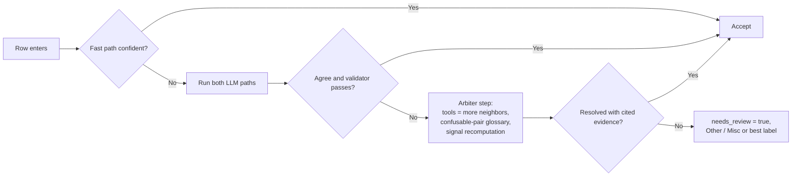

# LedgerLens: Accounting-Event Reasoning for Voucher Classification with Open-Source LLMs

> **Hacktober Fest | Open Source AI Hackathon | Organized by Elevate**
> **Track:** VYOM+ Intelligent Voucher Classification Using Open-Source LLMs
> **Round:** Qualifier (README-only technical proposal)
> **Team:** `<Team Name>` | **Members:** `<Member 1>`, `<Member 2>`, `<Member 3>`, `<Member 4>`

**One-line idea:** *Do not classify the row. Reconstruct the accounting event behind it, then derive the voucher from accounting rules, and let an independent classifier cross-check the result.*

---

## Table of Contents

1. [Project Name](#1-project-name)
2. [Problem Statement](#2-problem-statement)
3. [Project Overview](#3-project-overview)
4. [Proposed Solution](#4-proposed-solution)
5. [Objectives](#5-objectives)
6. [Target Users / Use Case](#6-target-users--use-case)
7. [Open-Source AI Technology Selected](#7-open-source-ai-technology-selected)
8. [Why This Technology Was Selected](#8-why-this-technology-was-selected)
9. [AI's Role in the System](#9-ais-role-in-the-system)
10. [System Architecture](#10-system-architecture)
11. [Component-Level Architecture](#11-component-level-architecture)
12. [Data / Information Flow](#12-data--information-flow)
13. [Agentic Workflow](#13-agentic-workflow-if-applicable)
14. [Technology Stack](#14-technology-stack)
15. [Expected Features](#15-expected-features)
16. [Implementation Approach](#16-implementation-approach)
17. [Expected Final Output](#17-expected-final-output)
18. [Future Scope / Scalability](#18-future-scope--scalability)
19. [Open-Source Dependencies / Components](#19-open-source-dependencies--components)
20. [Expected Challenges and Mitigation](#20-expected-challenges-and-mitigation)

---

## 1. Project Name

**LedgerLens**: a hybrid system in which an open-source LLM reconstructs the *accounting event* behind each transaction row and a transparent rule resolver converts that event into one of 27 voucher types, cross-checked by an independent classifier.

---

## 2. Problem Statement

Every transaction in an accounting system must be recorded under the correct **voucher type**. A wrong type posts to the wrong ledgers, distorts GST returns, and corrupts stock and payroll records. The 27 target categories mirror the predefined voucher types of mainstream accounting software such as Tally: accounting vouchers, inventory vouchers and order vouchers, plus payroll-related types.

Voucher type is not a property of any single field. It is a consequence of **what happened economically**: did goods move, did money move, in which direction, with whom, and was it a final invoice or only a commitment? Keyword rules and plain text classifiers fail because the same fields appear across very different vouchers.

| Confusable pair | Why shallow methods fail |
|---|---|
| Purchase vs Sales | The same invoice is a purchase for one party and a sale for the other. The answer depends on which party is *our company*. |
| Purchase Return vs Sales Return | Both carry return and debit/credit language. Direction decides the type. |
| Payment vs Contra | Both move money. Contra moves it between our own cash and bank accounts. |
| Journal vs Purchase / Sales / Expense | A journal is a non-cash, non-stock adjustment that can mention similar amounts. |
| Delivery Note / Receipt Note / Material In-Out / Stock Journal vs Sales / Purchase | These move stock with no financial invoice. |
| Order vs Invoice | Orders are commitments. Invoices are completed events. |
| Import / Export vs Purchase / Sales | Currency and customs fields change the category. |
| Advance vs Payment | Timing relative to the invoice or order changes the meaning. |

**Problem:** Given an Excel file of structured transactions with the voucher column removed, predict exactly one correct voucher type per row, robustly, explainably, efficiently and reproducibly, with an open-source model as the primary intelligence layer. The system must work on unseen records with missing or ambiguous fields.

---

## 3. Project Overview

Most solutions to this challenge will feed a row to an LLM and ask for a label. That approach is a black box that tends to learn surface patterns, and it cannot say *why* a row is a Contra instead of a Payment.

LedgerLens changes the unit of reasoning. For each row it:

1. Normalizes the data and infers **who the reporting company is** from the dataset itself.
2. Computes deterministic accounting signals.
3. Has an open-source LLM produce a structured **Accounting Event Hypothesis**: what moved (goods, money, stock), in which direction, between whom, in what status, and with what tax or cross-border context.
4. Passes that event through a **transparent Voucher Resolver**, a truth-table style decision graph grounded in how accounting software defines each voucher.
5. Runs an **independent direct classifier** over the same row, so two separate reasoning paths exist.
6. **Accepts on agreement**, and on disagreement runs an arbitration step that must cite the specific field evidence.
7. Uses a **cost cascade**: a fast classical model handles easy rows and the LLM is spent only on hard ones.

The result is accurate on confusable pairs, auditable (every label comes with an event and a rule trace), and efficient.

---

## 4. Proposed Solution

### 4.1 Core principle: voucher = f(accounting event)

Each voucher type is defined by its effect on **books, stock and commitments**, so we model that effect explicitly.

| Voucher family | Defining effect | Members |
|---|---|---|
| **Trade / Invoice** | Goods or services exchanged with a party, usually with tax | Purchase, Sales, Purchase Return / Debit Note, Sales Return / Credit Note, Import, Export, Expense |
| **Money movement** | Cash or bank balance changes | Payment, Receipt, Contra, Advance / Prepayment |
| **Adjustment** | Ledger-only correction with no cash or stock | Journal |
| **Inventory movement** | Stock changes with no invoice value | Receipt Note, Delivery Note, Rejection In, Rejection Out, Material In, Material Out, Stock Journal, Physical Stock |
| **Order / Commitment** | Promise made, no books or stock effect yet | Purchase Order, Sales Order, Job Work In Order, Job Work Out Order |
| **People / HR** | Employee-related | Salary / Payroll, Attendance |
| **Fallback** | Unclassifiable | Other / Miscellaneous |

*Family membership of borderline types (for example Expense and Import/Export) will be fixed after inspecting the provided dataset's conventions.*

### 4.2 Two independent paths with arbitration



Agreement between independent paths is a strong correctness signal, and disagreement identifies exactly the rows that need extra reasoning or human review.

### 4.3 Label scarcity solved by construction

The voucher column is hidden, so labeled data is scarce. We use an **event grammar**: we generate an accounting event first, render it into realistic transaction fields (names, items, GST, currencies, references), and the label is correct *by construction*. We add **minimal counterfactual pairs**, where flipping one attribute (the party's role, the money direction, a return marker) must flip the label. This trains the model on exactly the features that decide voucher type.

---

## 5. Objectives

| # | Objective | Measurable target (final hackathon) |
|---|---|---|
| 1 | Classify each row into one of 27 voucher types | Macro-F1 clearly above rules-only, TF-IDF and zero-shot LLM baselines |
| 2 | Resolve confusable pairs by accounting meaning | Highest gains on Purchase/Sales, Contra/Payment, Journal, inventory-vs-invoice pairs |
| 3 | Make every prediction explainable | Each row carries an event hypothesis and a rule trace |
| 4 | Use an open model as the primary classifier | 100% local open-model inference, with no proprietary API anywhere |
| 5 | Be robust to missing or noisy fields | Stable predictions under field-dropout stress tests |
| 6 | Be efficient | Cascade routes the majority of rows away from the LLM with minimal accuracy loss |
| 7 | Know what it does not know | Risk-coverage curve and a review flag for uncertain rows |
| 8 | Be reproducible | One-command evaluation with fixed seeds on a held-out split |

---

## 6. Target Users / Use Case

| User | Use case |
|---|---|
| **VYOM+ platform** | Assign voucher types automatically after invoice extraction, before the voucher is created. |
| **Accountants and bookkeepers** | Bulk-classify exported sheets and review only the flagged rows, with the reasoning shown. |
| **CA firms and SMEs** | Clean migrated or legacy books where voucher types are missing or wrong. |
| **Auditors** | Use the model as an independent second opinion on historical classifications. |

---

## 7. Open-Source AI Technology Selected

| Component | Selected technology | Notes |
|---|---|---|
| **Primary LLM** | **Gemma 4 E4B (instruction-tuned)**, open weights | Part of the Gemma 4 family released April 2026, Apache 2.0 per current listings (license to be re-verified at build time). Offers native system prompts, native function calling and configurable thinking modes. |
| **Fallback / swap model** | **Qwen2.5-7B-Instruct** or another Apache-licensed 3-8B model | Drop-in replacement through a model interface if tooling for Gemma 4 fine-tuning proves immature on the day. |
| **Adaptation method** | **QLoRA** (4-bit base plus LoRA adapters) with Hugging Face PEFT + TRL, optionally Unsloth | Fits a single mid-range GPU. |
| **Embeddings** | **BAAI/bge-small-en-v1.5** (sentence-transformers) | Retrieval of labeled precedents. |
| **Vector index** | **FAISS** | In-memory similarity search. |
| **Structured output** | **Outlines** or llama.cpp GBNF grammars | Forces valid JSON and valid labels. |
| **Inference** | **vLLM** (GPU) or **llama.cpp** (GGUF, CPU/low VRAM) | Local and offline. |
| **Fast-path model** | **LightGBM** on signals + embeddings | The cheap first stage of the cascade. |
| **Weak supervision** | Programmatic labeling functions (Snorkel-style, custom implementation) | Used on the real unlabeled rows. |

---

## 8. Why This Technology Was Selected

| Decision | Reasoning |
|---|---|
| **A small model (E4B class) instead of a huge one** | The task is structured reasoning over short records, not open-ended generation. A fine-tuned small model is fast, runs locally, and matches the challenge's weight on inference speed and compute efficiency. |
| **Gemma 4** | It is the newest open family from Google DeepMind, with reasoning and native structured-tool support. Configurable thinking lets us spend reasoning tokens **only on hard rows**, which fits our cascade directly. |
| **Event reconstruction before classification** | It forces the model to reason about accounting meaning (goods, money, direction, party, status), which is the stated core challenge. It also produces an audit trail. |
| **Rule resolver after the LLM** | Accounting definitions are stable and finite. Encoding them as a truth table removes label hallucination and keeps decisions inspectable. |
| **Independent second path** | Consensus between two different reasoning routes beats either alone, and disagreement is a free uncertainty signal. |
| **Retrieval of precedents** | Part of voucher semantics is convention. Showing similar labeled rows steers ambiguous cases without retraining. |
| **QLoRA** | Domain adaptation within hackathon compute limits. |
| **Why open source** | Financial data is sensitive, so local inference keeps it on the machine. Open weights allow fine-tuning, quantization, auditing and zero per-call cost, and the challenge requires it. |

**Limitations we plan around:** small models can emit invalid labels (constrained decoding), are sensitive to prompt format (a fixed serialization template), and can be overconfident (agreement-based and calibrated confidence). Tooling for brand-new model families can be unstable, so the fallback model is part of the design.

---

## 9. AI's Role in the System

The LLM is the **core reasoning engine** in both paths. It is not an optional add-on.

| Task | Performed by |
|---|---|
| Header mapping, type coercion, null handling | Deterministic code |
| Reporting-entity inference ("who is our company") | Statistics over the dataset |
| Hard signals (flags, ratios, markers) | Deterministic code |
| **Reconstruct the accounting event (goods, money, direction, party role, status)** | **Open-source LLM** |
| **Direct 27-way classification with retrieved precedents** | **Fine-tuned open-source LLM** |
| **Arbitrate disagreements, citing evidence** | **Open-source LLM (thinking mode)** |
| Map event to voucher via accounting rules | Rule resolver |
| Easy-row fast path | LightGBM |
| Metrics, stress tests, reports | Evaluation module |

Remove the LLM and only the weaker fast-path classifier remains, and we will report exactly how large that gap is.

---

## 10. System Architecture



**Deployment shape:** one local Python application with a CLI (`classify`, `evaluate`) and a lightweight Streamlit/Gradio review interface. Nothing leaves the machine.

---

## 11. Component-Level Architecture

| # | Component | Responsibility | Input | Output |
|---|---|---|---|---|
| 1 | **Ingestion and Header Mapper** | Read `.xlsx` and map varied headers to a canonical schema using a synonym dictionary plus fuzzy matching | Raw Excel | Normalized table |
| 2 | **Cleaner** | Type, date and currency normalization. Missing values stay explicit as `"not provided"` and are never silently imputed | Table | Clean table |
| 3 | **Reporting-Entity Inference** | Finds the company that appears across nearly every row as buyer or seller, which fixes the "our company" viewpoint for the whole file | Clean table | `our_company` + per-row `perspective` |
| 4 | **Signal Extractor** | Deterministic accounting signals (table below) | Row | Signal dict |
| 5 | **Fast-Path Classifier** | LightGBM over signals and embeddings. Confident rows exit here | Signals | Label + probability |
| 6 | **Row Serializer** | Stable compact text format of row plus signals | Row | Text block |
| 7 | **Precedent Retriever** | Embeds the row, retrieves top-k labeled neighbors from FAISS | Text | k examples |
| 8 | **Event Reconstructor (LLM)** | Fills the Accounting Event schema under constrained decoding | Text + signals | Event JSON |
| 9 | **Voucher Resolver** | Deterministic truth-table mapping from event to voucher type, returning the matched rule ID | Event JSON | Label + rule ID |
| 10 | **Direct Classifier (LLM)** | QLoRA-tuned 27-way classifier with precedents | Text + examples | Label + token log-probs |
| 11 | **Arbiter** | Resolves disagreement, must cite field evidence and a rule | Both outputs | Label + justification |
| 12 | **Calibrator and Validator** | Confidence from agreement and log-probs. Sanity checks (for example "Salary requires employee fields") | Outputs | Final label, confidence, review flag |
| 13 | **Exporter** | JSON, CSV and Excel with trace | Predictions | Files |
| 14 | **Evaluator** | Metrics, ablations, stress tests, risk-coverage curve | Predictions + truth | Report |
| 15 | **Interface** | Upload, inspect, review flagged rows | User | Results |

### The Accounting Event schema (what the LLM must fill)

| Field | Values |
|---|---|
| `nature` | goods, services, money_only, stock_only, commitment, payroll, attendance, adjustment |
| `stock_effect` | in, out, internal, count, none |
| `money_effect` | paid, received, internal_transfer, none |
| `perspective` | we_buy, we_sell, not_applicable |
| `counterparty_role` | supplier, customer, employee, bank_or_cash, self, unknown |
| `document_status` | final_invoice, order, challan_or_note, voucher_only, none |
| `is_reversal` | true / false (return, debit or credit note) |
| `cross_border` | true / false |
| `timing` | advance, settlement, normal, not_applicable |
| `evidence` | list of the row fields that justify the above |

### Voucher Resolver (illustrative truth-table excerpt)

| `nature` | `stock_effect` | `money_effect` | `perspective` | `document_status` | `is_reversal` | `cross_border` | Voucher |
|---|---|---|---|---|---|---|---|
| goods | in | none | we_buy | final_invoice | false | false | Purchase |
| goods | out | none | we_sell | final_invoice | false | false | Sales |
| goods | out | none | we_buy | final_invoice | true | false | Purchase Return / Debit Note |
| goods | in | none | we_sell | final_invoice | true | false | Sales Return / Credit Note |
| goods | in | none | we_buy | final_invoice | false | true | Import |
| goods | out | none | we_sell | final_invoice | false | true | Export |
| money_only | none | paid | we_buy | voucher_only | false | false | Payment |
| money_only | none | received | we_sell | voucher_only | false | false | Receipt |
| money_only | none | internal_transfer | not_applicable | voucher_only | false | false | Contra |
| money_only | none | paid | we_buy | voucher_only | false | false (timing = advance) | Advance / Prepayment |
| stock_only | in | none | we_buy | challan_or_note | false | false | Receipt Note |
| stock_only | out | none | we_sell | challan_or_note | false | false | Delivery Note |
| commitment | none | none | we_buy | order | false | false | Purchase Order |
| commitment | none | none | we_sell | order | false | false | Sales Order |
| payroll | none | paid | not_applicable | voucher_only | false | false | Salary / Payroll |
| adjustment | none | none | not_applicable | voucher_only | false | false | Journal |

*The complete table will cover all 27 voucher types and will be tuned against the real dataset conventions during the final.*

### Accounting signals (examples)

| Signal | Meaning | Helps separate |
|---|---|---|
| `perspective` | Whether our company is buyer or seller (from entity inference) | Purchase vs Sales, Payment vs Receipt |
| `has_gst`, `gst_type` | Tax present, and type | Taxable invoice vs Journal / Contra |
| `has_line_items`, `has_qty`, `has_hsn` | Goods flow | Invoices vs money or adjustment vouchers |
| `return_marker` | Return, debit or credit note reference, negative values | Returns vs normal invoices |
| `stock_without_value` | Quantity moves with no invoice or rate | Inventory vouchers |
| `order_ref_only` | Order reference without invoice number or tax | Orders vs invoices |
| `foreign_currency`, `customs_fields` | Cross-border indicators | Import / Export |
| `payroll_fields`, `attendance_fields` | Employee, PF, ESI, TDS, days present | Salary, Attendance |
| `cash_bank_both_sides` | Both sides are cash or bank | Contra |
| `advance_marker` | Payment before invoice or against order | Advance / Prepayment |
| `jobwork_marker`, `rejection_marker` | Job-work challan, QC reject | Job Work orders, Rejection In/Out |

---

## 12. Data / Information Flow



**Input:** an `.xlsx` file with one row per transaction. Fields may include seller/supplier, buyer/customer, invoice number and date, item descriptions, quantity, taxable value, GST, discounts, freight, payment information, currency, import/export details, payroll information, debit/credit information, return information, order and delivery references and other metadata. Any of them may be missing.

**Minimum output (per challenge spec):**

```json
{ "invoice_number": "INV-2026-1042", "voucher_type": "Purchase" }
```

**Extended output (ours):**

```json
{
  "invoice_number": "INV-2026-1042",
  "voucher_type": "Purchase",
  "confidence": 0.94,
  "explanation": "We are the buyer; goods received; final GST invoice; no money movement.",
  "event": { "nature": "goods", "stock_effect": "in", "perspective": "we_buy" },
  "rule_id": "R-PURCHASE-01",
  "paths_agree": true,
  "needs_review": false
}
```

---

## 13. Agentic Workflow (if applicable)

The system is mainly a pipeline. Agentic behavior is limited to a **bounded escalation loop** for hard rows, so average latency stays low.



- **Tools the arbiter can call:** larger-k precedent retrieval, a confusable-pair glossary (for example Contra vs Payment rules), and signal recomputation. Gemma 4's native function calling suits this.
- **Budget:** at most one arbitration per row.
- **Thinking mode:** enabled only inside the arbiter, so reasoning tokens go to the roughly smallest set of rows that need them.

---

## 14. Technology Stack

| Layer | Technology |
|---|---|
| Language | Python 3.10+ |
| Data | pandas, openpyxl, pydantic, rapidfuzz |
| LLM | Gemma 4 E4B-it (4-bit), fallback Qwen2.5-7B-Instruct, via Hugging Face Transformers |
| Adaptation | PEFT, TRL, bitsandbytes (optionally Unsloth) |
| Retrieval | sentence-transformers (bge-small-en-v1.5), FAISS |
| Structured output | Outlines or llama.cpp grammars |
| Inference | vLLM or llama.cpp (GGUF) |
| Fast path and baselines | LightGBM, scikit-learn (TF-IDF + Logistic Regression) |
| Weak supervision and data generation | Custom Python (labeling functions, event-grammar generator, Faker for names) |
| Evaluation | scikit-learn metrics, matplotlib / seaborn |
| Interface | Streamlit or Gradio |
| Packaging | requirements file, single CLI entrypoint, optional Docker |
| Repository | Public GitHub repo with an open-source license (Apache-2.0 planned) |

---

## 15. Expected Features

- Voucher prediction for **every row** across all **27 categories**.
- **Automatic header mapping** so differently named columns still work.
- **Reporting-entity inference**, which fixes the Purchase-vs-Sales viewpoint without manual configuration (with an override parameter).
- **Explainable output:** accounting event, rule ID, short explanation and cited fields for each row.
- **Two-path agreement** and an evidence-citing arbiter for disputed rows.
- **Cost cascade** that sends easy rows through a fast model and hard rows through the LLM.
- **Confidence and a review flag**, with a risk-coverage curve showing accuracy at each level of automation.
- **Strict JSON** plus Excel/CSV export, with zero malformed outputs.
- **Reproducible evaluation** in one command: accuracy, precision, recall, F1 (macro, weighted, per class), confusion matrix, latency and throughput.
- **Metamorphic robustness suite:** automatic tests such as swapping buyer and seller (Purchase must become Sales), dropping non-decisive fields (label must not change), and flipping money direction (Payment must become Receipt).
- **Ablation table:** rules only, TF-IDF + LR, zero-shot LLM, LLM + retrieval, event path only, direct path only, and the full hybrid.
- **Local and offline** inference.

---

## 16. Implementation Approach

### 16.1 Data strategy

| Source | How it is used |
|---|---|
| **Event-grammar synthetic data** | Generate an accounting event for each of the 27 types, render it into realistic fields (parties, items, GST, currencies, references). Labels are correct by construction. |
| **Counterfactual minimal pairs** | For each synthetic row, create a twin with one decisive attribute flipped (role, direction, return marker, timing) and the label changed accordingly. |
| **Hard negatives and noise** | Near-miss pairs plus random field dropout, typos and column-name variation. |
| **Weak labeling of the real rows** | High-precision labeling functions derived from the resolver rules and signals, combined by voting, plus a zero-shot LLM as teacher. |
| **Hand-verified gold set** | The team manually labels a small sample of real rows. It is **held out** from training and retrieval and used only for evaluation. |

### 16.2 Model strategy (tiered so something always ships)

| Tier | What | Guarantee |
|---|---|---|
| **Tier 1** | Ingestion, signals, entity inference, rule resolver, LightGBM baseline | Working classifier and metrics early |
| **Tier 2** | LLM event reconstruction plus resolver, with retrieval-based direct classifier, constrained JSON, two-path agreement | End-to-end open-LLM system |
| **Tier 3** | QLoRA fine-tuning on synthetic plus corrected data, arbiter, calibration, cascade tuning | Accuracy and efficiency gains |
| **Tier 4** | Metamorphic suite, ablation report, UI polish | Evaluation depth |

### 16.3 Hackathon-day plan (10 October)

| Phase | Work | Output |
|---|---|---|
| 1 | Setup, ingestion, header mapper, entity inference, signals | Clean canonical data |
| 2 | Event grammar and synthetic generator; resolver truth table; LightGBM baseline | Baseline metrics |
| 3 | LLM event reconstruction, retrieval, direct classifier, agreement logic | Working two-path system |
| 4 | QLoRA run, arbiter, calibration, cascade | Improved system |
| 5 | Evaluation script, metamorphic tests, ablation, interface, demo | Final submission |

### 16.4 Evaluation design

- Fixed seeds and a documented train / validation / gold-test split.
- Metrics: accuracy, precision, recall, F1 (macro, weighted, per class), confusion matrix with emphasis on the confusable pairs listed in Section 2.
- Efficiency: latency per row, throughput, and the fraction of rows handled without the LLM.
- Robustness: metamorphic tests and field-dropout stress tests.
- Reliability: risk-coverage curve and calibration check.

---

## 17. Expected Final Output

1. A **public GitHub repository** with code, requirements file, CLI and documentation under an open-source license.
2. A **working classifier** returning a voucher type for every row in an input `.xlsx`.
3. **Predictions** as `predictions.json` and `predictions.xlsx` / `.csv`, with `invoice_number`, `voucher_type`, `confidence`, `explanation`, `event`, `rule_id` and `needs_review`.
4. A **reproducible evaluation report**: per-class metrics, confusion matrix, confusable-pair analysis and latency numbers.
5. An **ablation table** showing what each component contributes.
6. A **metamorphic robustness report**.
7. A **review interface** for inspecting flagged rows with their reasoning trace.
8. A short **demo** on unseen records featuring hard confusable cases.

---

## 18. Future Scope / Scalability

| Area | Extension |
|---|---|
| **Pipeline integration** | Chain with the VYOM+ invoice-extraction track: scan or image to structured row to voucher type to automatic voucher creation. |
| **Beyond classification** | The reconstructed event already implies debit and credit sides, so the system can propose ledger entries and GST treatment. |
| **Scale** | Batch inference with vLLM, queues and sharding. Distill the two-path system into a single small model for bulk runs. The cascade already minimizes LLM calls. |
| **Learning loop** | Accountant corrections on flagged rows feed the precedent index and periodic LoRA refreshes (active learning). |
| **Customization** | Per-company adapters and per-company resolver rule overrides for non-standard conventions. |
| **Coverage** | Other tax regimes, multilingual descriptions, additional voucher types. |
| **Audit** | Event and rule traces stored as an audit trail. |
| **Deployment** | Docker image, FastAPI service and on-premise or edge deployment using quantized models. |

---

## 19. Open-Source Dependencies / Components

| Component | Purpose | Type |
|---|---|---|
| Gemma 4 E4B-it (fallback: Qwen2.5-7B-Instruct) | Event reconstruction, direct classification, arbitration | Open-weight LLM / SLM |
| Hugging Face Transformers | Model loading and inference | Library |
| PEFT, TRL, bitsandbytes (optionally Unsloth) | QLoRA fine-tuning | Training libraries |
| sentence-transformers + BAAI/bge-small-en-v1.5 | Embeddings | Embedding model |
| FAISS | Precedent retrieval | Vector index |
| Outlines / llama.cpp grammars | Constrained structured output | Inference tooling |
| vLLM / llama.cpp | Efficient local inference | Inference engines |
| LightGBM, scikit-learn | Fast path, baselines, metrics | ML libraries |
| pandas, openpyxl, pydantic, rapidfuzz, Faker | Data handling, validation, synthetic data | Libraries |
| Streamlit / Gradio | Interface | Framework |
| matplotlib / seaborn | Evaluation plots | Libraries |

All components are open-source or openly licensed. Individual model licenses will be re-verified before the final submission.

---

## 20. Expected Challenges and Mitigation

| # | Challenge | Impact | Mitigation |
|---|---|---|---|
| 1 | **Hidden labels in the provided dataset** | Hard to train and evaluate | Event-grammar synthetic data (correct by construction), weak labeling, a hand-verified held-out gold set. |
| 2 | **Confusable classes** | Frequent errors on pairs such as Purchase/Sales and Contra/Payment | Event reconstruction, rule resolver, counterfactual minimal pairs, two-path agreement, arbiter. |
| 3 | **"Who is our company" is unknown** | Systematic direction errors | Reporting-entity inference from the dataset, an override parameter, and low confidence if inference is ambiguous. |
| 4 | **Dataset conventions differ from our assumed rules** | Resolver misclassifies some types | The resolver is a data table, easy to edit. The direct path and the fast path act as independent checks, and disagreement triggers the arbiter. |
| 5 | **Class imbalance (rare types)** | Poor recall on rare classes | Balanced synthetic generation, macro-F1 as the headline metric, per-class reporting. |
| 6 | **Missing or conflicting fields** | Unstable predictions | Explicit `"not provided"` tokens, noise-injection training, stress tests, review flag. |
| 7 | **Small-model hallucination or malformed output** | Invalid labels or JSON | Constrained decoding over closed schemas and pydantic validation. |
| 8 | **Overconfidence** | Wrong rows pass silently | Agreement-based plus log-prob confidence, calibration on validation data, risk-coverage analysis. |
| 9 | **Tooling immaturity for a new model family** | Fine-tuning or serving problems | Model interface with Qwen2.5 fallback. Tier 2 works without fine-tuning. |
| 10 | **Limited time and compute** | Incomplete build | Tiered plan where Tiers 1-2 already form a complete open-LLM classifier. Use 4-bit quantization and the small model. |
| 11 | **Latency of two LLM paths** | Slow batch runs | Cascade skips the LLM for easy rows, short prompts, vLLM batching, and thinking mode only in the arbiter. |
| 12 | **Overfitting to synthetic data** | Poor generalization | Mix corrected real rows, vary templates and noise, and report results only on the held-out real gold set. |
| 13 | **Reproducibility** | Results cannot be checked | Fixed seeds, pinned versions, one evaluation command, logged configurations. |

---

## Reproducibility Note (planned for the final repository)

The final repository will include a requirements file, documented `classify` and `evaluate` commands, fixed random seeds, the data-split procedure and the report format, so an evaluator can run the whole pipeline on a hidden labeled dataset and obtain comparable metrics.

---

*This README is the qualifier technical proposal. No source code, datasets, notebooks, binaries or generated files are included in this repository, as required by the qualifier rules. Implementation will be built during the final hackathon.*
